# 🐲 Workshop C++ S1 - IMAC

**Workshop créé par [Jules Fouchy](https://github.com/JulesFouchy).**

🎓 *Étudiants : DE SANTIS Léo & DUPUIS Maxence.*

**On s'intéresse ici à la création d'effets sur des images avec C++ !**
**Il s'agit d'une première introduction à la synthèse d'image.**
<br>

\*📁 Cet émoji vous permet d'accéder directement au code source des projets.
<br>
<br>

## :triangular_flag_on_post: Les bases

On utilise la bibliothèque **sil**.

- **sil** nous permet de lire, éditer (via les pixels) et sauvegarder des images.

```cpp
#include <sil/sil.hpp> //Directive de préprocesseur pour inclure sil

 sil::Image image{"mon_image.png"}; //Import d'une image

    image.save("resultat.png"); //Sauvegarde et affichage de l'image
```
<br>
<br>


## ⭐ Ne garder que le vert

| Avant                        | Après                                  |
| ---------------------------- | -------------------------------------- |
|  |  |

📁 [Code source](https://github.com/smallboyc/imac-cpp-workshop/blob/main/src/green/main.cpp)

### Description :

- On souhaite simplement garder active la composante Verte.

### Spécificités :

- Il suffit de rendre nulle les composantes rouge et bleu de chaque pixels en les parcourant.

```cpp
int main()
{
    sil::Image image{"images/logo.png"};
    for (glm::vec3 &color : image.pixels())
    {
        color.r = 0.f;
        color.b = 0.f;
    }
    image.save("output/pouet.png");
}
```

<br>
<br>


## ⭐ Échanger les canaux

| Avant                        | Après                                     |
| ---------------------------- | ----------------------------------------- |
|  |  |

📁 [Code source](https://github.com/smallboyc/imac-cpp-workshop/blob/main/src/exchange/main.cpp)

### Description :

- On souhaite inverser les canaux RGB entre eux. Essayons d'inverser le canal bleu et rouge.

### Spécificités :

- Méthode 1 : Utiliser une variable temporaire.
- Méthode 2 : Utiliser la fonction **swap** de la bibliothèque standard pour échanger 2 valeurs.
```cpp
//Méthode 1
int main()
{
    sil::Image image{"images/logo.png"};
    for (glm::vec3 &color : image.pixels())
    {
        float temp{color.b};
        color.b = color.r;
        color.r = temp;
    }
    image.save("output/pouet.png");
}
```
```cpp
//Méthode 2
int main()
{
    sil::Image image{"images/logo.png"};
    for (glm::vec3 &color : image.pixels())
        std::swap(color.b, color.r);
    image.save("output/pouet.png");
}
```
❗**Bien que ce code ne soit pas imposant. La méthode 2 est intéressante pour un code plus lisible et optimisé.**

### Potentiels problèmes

- Écraser une variable
```cpp
int main()
{
    sil::Image image{"images/logo.png"};
    for (glm::vec3 &color : image.pixels())
    {
        color.b = color.r;
        color.r = color.b;
    }
    image.save("output/pouet.png");
}
```
Dans le code ci-dessus, on se retrouve avec un canal bleu ayant la même valeur que celle du canal rouge. On perd l'information sur **color.b**,  d'où l'importance d'une variable temporaire **temp**.


<br>
<br>

## ⭐ Noir & Blanc

| Avant                        | Après                                        |
| ---------------------------- | -------------------------------------------- |
|  |  |

📁 [Code source](https://github.com/smallboyc/imac-cpp-workshop/blob/main/src/black_white/main.cpp)

### Description :

- On souhaite transformer notre image en noir et blanc.

### Spécificités :

- Il faut faire la moyenne de la somme des composantes RGB de chaque pixels, et attribuer à chaque canaux le résultat de ce calcul. Ce résultat se nomme **la nuance de gris**.
```cpp
int main()
{
    sil::Image image{"images/logo.png"};
    for (glm::vec3 &color : image.pixels())
    {
        float moyenne{(color.r + color.g + color.b) / 3.0f};
        color.r = moyenne;
        color.g = moyenne;
        color.b = moyenne;
    }
    image.save("output/pouet.png");
}
```

<br>
<br>

## ⭐ Négatif

| Avant                        | Après                                     |
| ---------------------------- | ----------------------------------------- |
|  |  |

📁 [Code source](https://github.com/smallboyc/imac-cpp-workshop/blob/main/src/negative/main.cpp)

### Description :

- On souhaite inverser le noir et le blanc 

### Spécificités :

- Analysons... On veut que :
> 0 ➡️ 1, 1 ➡️ 0, 0.8 ➡️ 0.2 ...
- En généralisant on devine la formule : **f(x) = 1 - x**
- Il suffit donc d'**appliquer cette formule** aux composantes RGB de tous nos pixels !

<br>
<br>

## ⭐ Dégradé


📁 [Code source](https://github.com/smallboyc/imac-cpp-workshop/blob/main/src/mosaique_miroir/main.cpp)

### Description :

- On souhaite parcourir toute notre largeur en passant progressivement du noir au blanc.

### Spécificités :

- On remarque que si on fixe un **x** quelconque, les **y** correspondant ne changent pas. On a donc des lignes verticales de même valeur.
- **x** varie de **0** à **width - 1** (largeur de l'image).
- La variation de teinte doit donc prendre en compte la **width** (largeur) et la variable **x**.
- On doit faire le rapport **x / (width - 1)** pour chaque pixel. En effet, ce rapport nous donne 1 si on arrive au dernier pixel et 0 au départ. L'incrément nous donnera une valeur de plus en plus blanche. **BINGO !** 😜


```cpp
int main()
{
    sil::Image image{300, 200};
    for (float x{0}; x < image.width(); x++)
    {
        for (float y{0}; y < image.height(); y++)
        {
            image.pixel(x, y).r = x / (image.width() - 1);
            image.pixel(x, y).g = x / (image.width() - 1);
            image.pixel(x, y).b = x / (image.width() - 1);
        }
    }
    image.save("output/pouet.png");
}
```

### Potentiels problèmes

- Remplacer le **float** par un **int**. 
- Les valeurs prises par les composantes RGB sont des nombres décimaux variants de 0 à 1.
- Diviser un **int** par un **int**, ça donne... un **int** ! Et donc, nos valeurs seraient toutes arrondies à 0, sauf le rapport donnant tout juste 1 ! A savoir le **dernier pixel** (voir résultat ci-dessous).

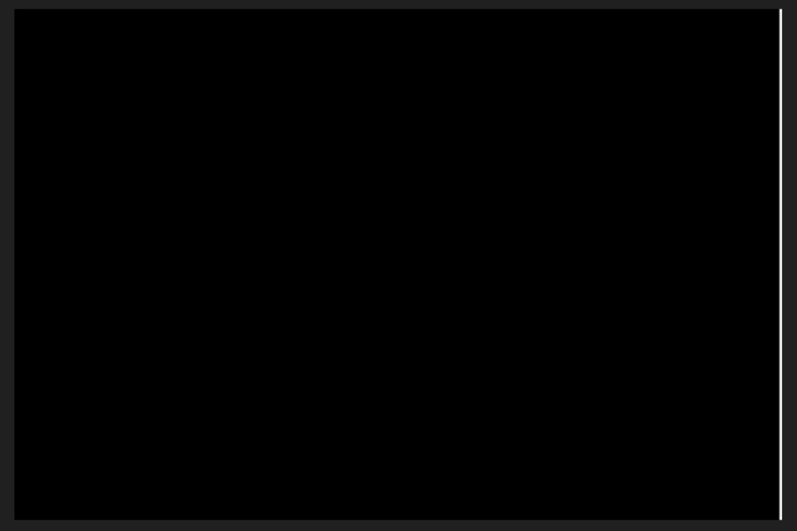

  ❗**Les bords gris ont été rajoutés pour bien discerner l'erreur.**

<br>
<br>

## ⭐⭐ Miroir

| Avant                          | Après                                   |
| ------------------------------ | --------------------------------------- |
| 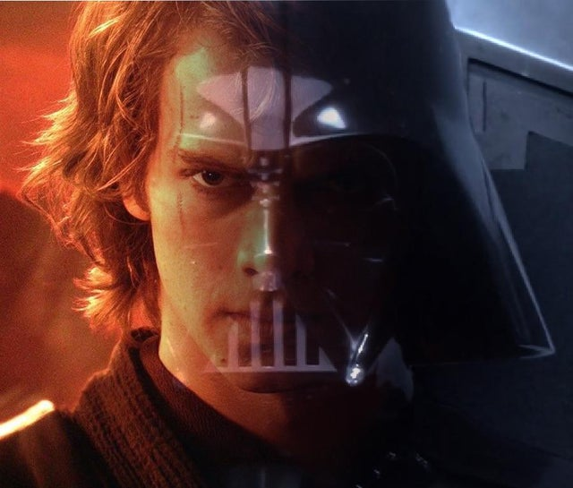 | 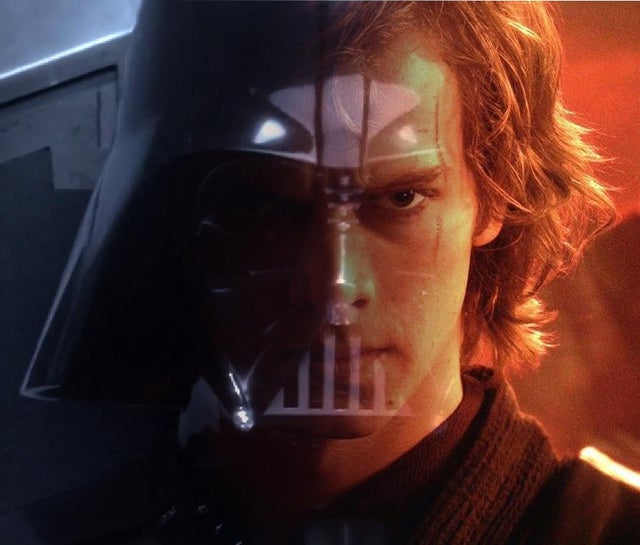 |

📁 [Code source](https://github.com/smallboyc/imac-cpp-workshop/blob/main/src/mirror/main.cpp)

### Description :

- On souhaite effectuer une rotation verticale de notre image.

### Spécificités :

- L'idée est de parcourir chaque pixel et d'échanger le pixel concerné par le pixel qui lui est **opposé en x**.
- Il faut cependant seulement **parcourir le moitié de la largeur**. En effet, arrivé à la moitié, notre image aura déjà été inversée.
  
```cpp
int main()
{
    sil::Image image{"images/anakin.jpg"};
    for (int x{0}; x < image.width() / 2; x++)
    {
        for (int y{0}; y < image.height(); y++)
            std::swap(image.pixel(x, y), image.pixel(image.width() - (x + 1), y));

    }
    image.save("output/pouet.png");
}
```

### Potentiels problèmes
- Parcourir la totalité de la **width**. La conséquence, c'est d'avoir une image **similaire** à celle d'origine. En réalité, elle aura été inversée **2 fois**.

<br>
<br>

## ⭐⭐ Image Bruitée

| Avant | Après |
| ----------- | ----------- |
|  | 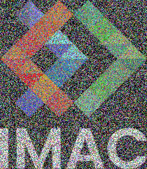 |

📁 [Code source](src/noise/main.cpp)

### Description
Dans cet exercice, un effet aléatoire de couleur (bruit) a été appliqué à l'image. Chaque pixel de l'image a été modifié en assignant une couleur aléatoire. Pour ce faire, les composantes R (rouge), G (vert) et B (bleu) de chaque pixel ont été remplacées par des valeurs aléatoires comprises entre 0 et 1.

### Spécificités
- On utilise la fonction `random_int` pour trouver une position aléatoire sur notre image. `random_float` nous permet de générer un float aléatoire entre 0 et 1 qui sera attribué aux différentes composantes RGB du pixel.
- On génère `image.pixels().size()-1` pixels aléatoires !
```cpp
#include "random.hpp"

int main()
{
    sil::Image image{"images/logo.png"};

    for (size_t i = 0; i < image.pixels().size(); i++)
    {
        int x_random = random_int(0, image.width());
        int y_random = random_int(0, image.height());
        image.pixel(x_random, y_random).r = random_float(0, 1.0f);
        image.pixel(x_random, y_random).g = random_float(0, 1.0f);
        image.pixel(x_random, y_random).b = random_float(0, 1.0f);
    }

    image.save("output/pouet.png");
}
```

<br>
<br>

## ⭐⭐ Rotation de 90°

| Avant | Après |
| ----------- | ----------- |
|  |  |

📁 [Code source](src/rotate_90/main.cpp)

### Description
Dans cet exercice, une rotation de l'image originale à 90 degrés dans le sens horaire a été effectuée. L'algorithme utilise une approche de manipulation des pixels pour réaliser cette rotation.

### Spécificités
- Parcourir chaque pixel de l'image d'origine et le placer dans une nouvelle image avec des coordonnées modifiées pour effectuer la rotation.
- L'implémentation de la rotation se fait en échangeant les coordonnées x et y des pixels entre l'image d'origine et la nouvelle image résultante.
  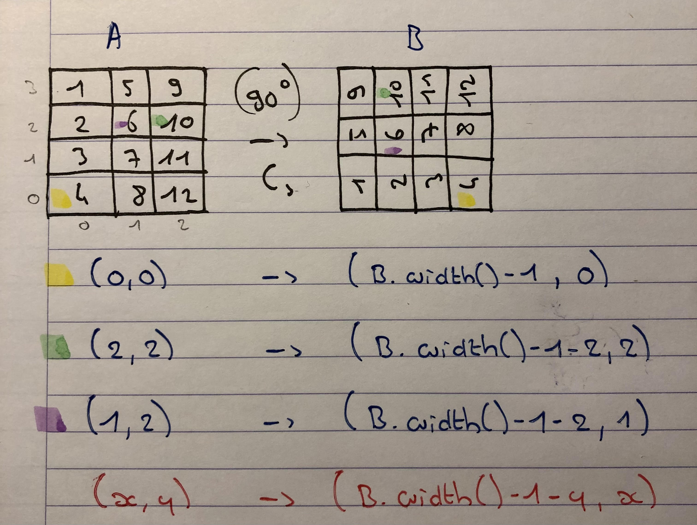
- Le papier et le crayon sont toujours de bons outils !
```cpp
int main()
{
    sil::Image image{"images/logo.png"};
    sil::Image voidImage{image.height(), image.width()};
    for (int x{0}; x < image.width(); x++)
    {
        for (int y{0}; y < image.height(); y++)
            voidImage.pixel(voidImage.width() - 1 - y, x) = image.pixel(x, y);
    }
    voidImage.save("output/pouet.png");
}
```

<br>
<br>

## ⭐⭐ RGB Split

| Avant | Après |
| ----------- | ----------- |
|  | 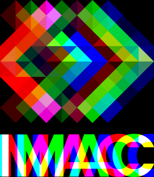 |

📁 [Code source](src/rgb_split/main.cpp)

### Description
Dans cet exercice, un effet de séparation des canaux RGB (RGB split) a été appliqué à l'image. L'algorithme modifie les canaux Rouge (R), Vert (G), et Bleu (B) de l'image pour créer une version où chaque canal est décalé par rapport aux autres.

### Spécificités
- Trois boucles distinctes sont utilisées pour traiter séparément les composantes Rouge, Vert et Bleu de chaque pixel de l'image.
- Pour chaque composante de couleur, une boucle spécifique effectue un décalage des pixels à gauche ou à droite en fonction du canal (R, G ou B) tout en conservant les autres canaux.

### Pièges potentiels à éviter
- Ne pas oublier de décaler les valeurs de pixels.
- Modifier l'image d'origine. Les calculs seront faussés par les précédentes modifications effectués sur les pixels qui ont été réattribués à l'image d'origine.

<br>
<br>

## ⭐⭐ Luminosité

| Après Assombrissement | Avant | Après Eclaircissement |
| --- | :-: |  --: |
|  |  |  |

📁 [Code source](src/luminosite/main.cpp)

### Description
Dans cet exercice, un effet d'assombrissement ou d'éclaircissement de l'image a été appliqué en utilisant une variable `number`. Cette variable est utilisée pour modifier la puissance des canaux Rouge (R), Vert (G) et Bleu (B) de chaque pixel de l'image.

### Spécificités
- Une boucle parcourt chaque pixel de l'image et ajuste la valeur de chaque composante de couleur en fonction de la valeur de `number`.
- La fonction `pow` est utilisée pour augmenter ou diminuer la valeur des canaux RVB en fonction de la valeur de `number`, ce qui permet de contrôler l'intensité lumineuse des pixels.

### Pièges potentiels à éviter
- Multiplier les valeurs sans les fonctions puissances. Cela nous donnerait un resultat trop saturé.

<br>
<br>


## ⭐⭐ Disque

| Image |
| --- |
| 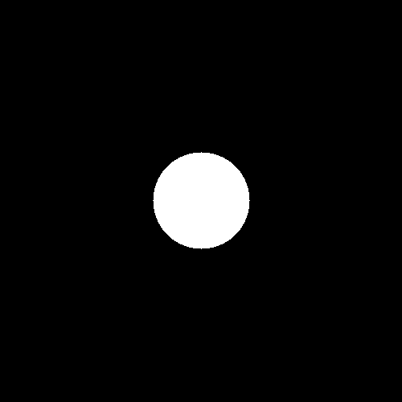 |

📁 [Code source](src/disque/main.cpp)

### Description
Dans cet exercice, la formation d'un disque a été appliqué à une image de 500x500. L'algorithme remplit les pixels de l'image pour former un disque centré sur l'image.

### Spécificités
- Les pixels situés à l'intérieur du cercle défini par l'équation sont colorés en blanc en vérifiant si sa position correspond à celle à l'intérieur du disque à l'aide d'une équation de cercle.
  
```cpp
int main()
{
    sil::Image image{500, 500};
    int rayon{60};
    for (int x{0}; x < image.width(); x++)
    {
        for (int y{0}; y < image.height(); y++)
        {
            if (pow(x - image.width() / 2, 2) + pow(y - image.height() / 2, 2) <= pow(rayon, 2))
            {
                image.pixel(x, y) = {1,
                                     1,
                                     1};
            }
        }
    }
    image.save("output/pouet.png");
}
```

<br>
<br>

## ⭐ Cercle

| Image |
| --- |
| 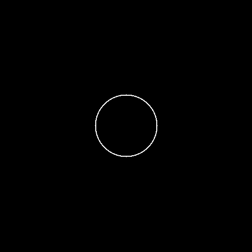 |

📁 [Code source](src/cercle/main.cpp)

### Description
Dans cet exercice, la formation d'un cercle a été appliqué à une image de 500x500. L'algorithme dessine un cercle avec un rayon et une épaisseur de contours variable.

### Spécificités
- Les pixels situés à l'intérieur du cercle sont laissés vides, tandis que ceux se trouvant dans l'épaisseur des contours sont colorés en blanc en déterminant s'ils se trouvent à l'intérieur du cercle ou dans l'épaisseur de ses contours à l'aide d'une équation de cercle modifiée.

```cpp
int main()
{
    sil::Image image{500, 500};
    int rayon{60};
    int thickness{2};
    for (int x{0}; x < image.width(); x++)
    {
        for (int y{0}; y < image.height(); y++)
        {
            if (pow(x - image.width() / 2, 2) + pow(y - image.height() / 2, 2) >= pow(rayon, 2) && pow(x - image.width() / 2, 2) + pow(y - image.height() / 2, 2) <= pow(rayon + thickness, 2))
            {
                image.pixel(x, y) = {1,
                                     1,
                                     1};
            }
        }
    }
    image.save("output/pouet.png");
}
```

<br>
<br>

## ⭐⭐⭐ Rosace

| Image |
| --- |
| 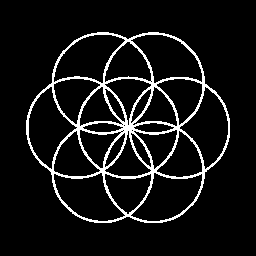 |

📁 [Code source](src/rosace/main.cpp)


### Description
Dans cet exercice, la formation d'une rosace a été appliqué à une image de 500x500. L'algorithme dessine une rosace en superposant plusieurs cercles avec des épaisseurs de contour variables.

### Spécificités
- Chaque cercle est défini avec un rayon, une épaisseur de contour et une position de centre différents.
- Le centre défini des cercles est calculé en fonction du cercle trigonométrique par des coordonnées polaires.
- On implémente une fonction `createCircle` car on remarque que la tâche à effectuer est la même que pour le cercle avec des centres différents.
  
```cpp
void createCircle(sil::Image &image, int &x, int &y, int &center_x, int &center_y, int &rayon, int &thickness)
{
    if (pow(x - center_x, 2) + pow(y - center_y, 2) >= pow(rayon - thickness, 2) && pow(x - center_x, 2) + pow(y - center_y, 2) <= pow(rayon + thickness, 2))
    {
        image.pixel(x, y) = {1,
                             1,
                             1};
    }
}
```
- L'utilité de la fonction nous permet d'entrer les nouvelles coordonnées des centres après le calcul de ce dernier via les formules de trigonométrie. On remarque 6 cercle positionnés tous les $i\pi/3$. $i$ allant donc de 1 à 6.
 
```cpp
int main()
{
    sil::Image image{500, 500};
    int rayon{60};
    int thickness{2};
    int center_x{image.width() / 2};
    int center_y{image.height() / 2};
    for (int x{0}; x < image.width(); x++)
    {
        for (int y{0}; y < image.height(); y++)
        {
            createCircle(image, x, y, center_x, center_y, rayon, thickness);
            for (int i{1}; i <= 6; i++)
            {
                int newCenter_x{static_cast<int>(center_x + rayon * static_cast<float>(cos(i * 3.14f / 3)))};
                int newCenter_y{static_cast<int>(center_y + rayon * static_cast<float>(sin(i * 3.14f / 3)))};
                createCircle(image, x, y, newCenter_x, newCenter_y, rayon, thickness);
            }
        }
    }
    image.save("output/pouet.png");
}
```
### Pièges potentiels à éviter
- Oublier d'ajouter un nouveau centre pour chaque cercle en fonction du centre de base.
- Oublier les passages par référence.

<br>
<br>

## ⭐⭐ Mosaïque

| Avant | Après |
| ----------- | ----------- |
|  |  |

📁 [Code source](src/mosaique/main.cpp)

### Description
Dans cet exercice, un effet de mosaïque a été appliqué à l'image en utilisant une version agrandie de l'image originale. L'algorithme divise l'image en une grille de carrés identiques et place des copies de l'image originale dans chaque carré.

### Spécificités
- Une fonction `newImacPoster` est utilisée pour placer une copie de l'image originale à une position spécifique dans la nouvelle image.
- Sur une grille de carrés est utilisé la fonction `newImacPoster` pour répliquer l'image dans chaque carré de la grille, formant ainsi l'effet de mosaïque.
- Les variables `position_x` et `position_y` sont essentielles afin de parcourir correctement la nouvelle image et afficher l'originale.

```cpp
void newImacPoster(sil::Image &image, sil::Image &newImage, int const &position_x, int const &position_y)
{

    for (int x{0}; x < image.width(); x++)
    {
        for (int y{0}; y < image.height(); y++)
        {
            newImage.pixel(position_x + x, position_y + y) = image.pixel(x, y);
        }
    }
}
```
- Le ratio du nombre de carré est modulable grâce à une variable `ratio` présente au début du `main`.
```cpp
int main()
{
    sil::Image image{"images/arcane.jpg"};
    int ratio{5};
    sil::Image newImage{ratio * image.width(), ratio * image.height()};

    for (int i{0}; i < ratio; i++)
    {
        for (int j{0}; j < ratio; j++)
            newImacPoster(image, newImage, j * image.width(), i * image.height());
    }
    newImage.save("output/pouet.png");
}
```

### Pièges potentiels à éviter
- Oublier de créer une nouvelle image pour y implanter nos autres images.
- Oublier les références (surtout sur `newImage`).

<br>
<br>


## ⭐⭐⭐ Mosaïque miroir

| Avant                          | Après                                                                      |
| ------------------------------ | -------------------------------------------------------------------------- |
|  |  |

📁 [Code source](https://github.com/smallboyc/imac-cpp-workshop/blob/main/src/mosaique_miroir/main.cpp)

### Description :

- Similaire à une mosaïque classique, mais on y ajoute des renversements ciblés sur l'axe **x** et **y**.

### Spécificités :

- On sait comment obtenir la mosaïque (c'est déjà bien).
- Maintenant, on remarque que toutes les images sur les colonnes impaires subissent un miroir par rapport à la verticale (on sait faire ça, on l'a fait sur l'algorithme ⭐⭐ **Miroir**). 
- On remarque aussi que toutes les lignes impaires subissent un miroir par rapport à l'horizontale (en fait c'est le ⭐⭐**Miroir** adapté pour l'horizontale. Il suffit juste d'inverser **y** et **x**).
- L'idée est donc de créer une fonction qui nous permettrait de renverser soit selon la verticale, soit selon l'horizontale. On va utiliser un booléen qui conditionnera nos variables. Allez let's go!
```cpp
void mirror(sil::Image &image, bool const reverse_y)
{
    int divide_x{2};
    int divide_y{1};

    if (reverse_y)
    {
        divide_x = 1;
        divide_y = 2;
    }

    for (int x{0}; x < image.width() / divide_x; x++)
    {
        for (int y{0}; y < image.height() / divide_y; y++)
        {
            int select_x{image.width() - (x + 1)};
            int select_y{y};
            if (reverse_y)
            {
                select_x = x;
                select_y = image.height() - (y + 1);
            }

            std::swap(image.pixel(x, y), image.pixel(select_x, select_y));
        }
    }
}
```
- Voilà la fonction *mirror* ! Si je passe **reverse_y** à **false**, on aura notre ⭐⭐ **Miroir**, si on le set à **true**, c'est la même chose mais selon les **y**.
  
```cpp
int main()
{
    sil::Image const image{"images/arcane.jpg"};
    int ratio{6};
    bool reverseEffect{true};
    sil::Image newImage{ratio * image.width(), ratio * image.height()};

    for (int i{0}; i < ratio; i++)
        for (int j{0}; j < ratio; j++)
        {
            sil::Image copy{image};

            if (reverseEffect)
            {
                if (j % 2 != 0)
                    mirror(copy, false);

                if (i % 2 != 0)
                    mirror(copy, true);
            }

            printPoster(copy, newImage, j * image.width(), i * image.height());
        }

    newImage.save("output/pouet.png");
}
```
- Voilà le *main* avec un booléen **reverseEffect**. Si ce dernier est set à **false**, on retrouvera notre **mosaïque classique**. Sinon, on applique nos changements et **BOOM**, ça fait des chocapics !

### Potentiels problèmes
- Oublier l'**&** (Référence): Fondamentale pour garder le **lien** avec la variable d'origine, et donc de pouvoir garder et **modifier de l'information** dans une fonction. On a alors une **portée globale** (la modification d'une variable interne à la fonction a une répercussion sur la variable, partout dans le code). Il ne faut surtout pas l'oublier quand on passe l'**image** en paramètre de notre fonction.
- Oublier de faire une **copy** de l'image dans le *main* à l'intérieur de notre boucle est une erreur. Si on cible l'image défini au début du *main* directement, le miroir appliqué à notre image ne se réinitialise pas. On travaille avec une **même image** qui **cumule les miroirs**, et on est pas au bout de nos surprises.
<br>
<br>

## ⭐⭐⭐ Glitch
| Avant                        | Après                                          |
| ---------------------------- | ---------------------------------------------- |
|  | 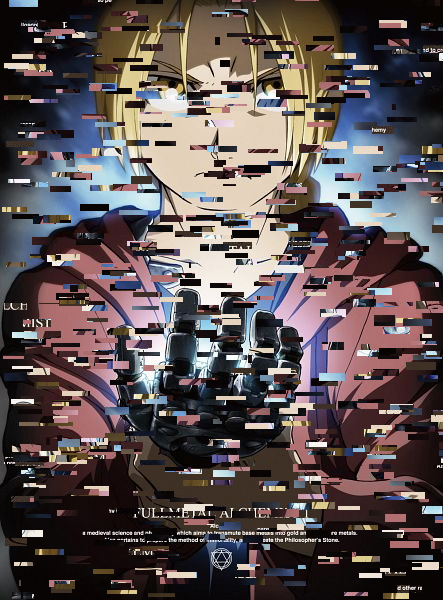 |

📁 [Code source](https://github.com/smallboyc/imac-cpp-workshop/blob/main/src/glitch/main.cpp)
### Description :

- On souhaite sélectionner 2 **rectangles de pixels** aux **hasard** dans l'image et les **échanger**. Les tailles sont gérés aléatoirement mais les 2 rectangles doivent avoir **la même taille**.

### Spécificités :
- On va utiliser la librairie `glm` pour manipuler des `vec2` nous permettant de stocker une position x et y. Notre code sera alors plus lisible et plus simple à gérer.
- L'idée est de générer 2 `vec2`. Un 1er avec la position du pixel de départ de notre 1er rectangle. Et un second avec la position de départ du 2ème rectangle.
```cpp
glm::vec2 inputPositionStart{random_int(0, image.width()),random_in(0, image.height())};
glm::vec2 outputPositionStart{random_int(0, image.width()), random_int(0, image.height())};
```
- Il faut parcourir une taille **commune** `rectangleSize` pour pouvoir échanger le même nombre de pixel.
 ```cpp
glm::vec2 rectangleSize{random_int(20, 30), random_int(3, 8)};
```
- Il suffit de boucler en vérifiant que nos pixels sont bien contenu dans l'image, puis d'utiliser la fonction `std::swap` et le tour est joué.
  
```cpp
   for (int i{0}; i <= rectangleSize.x; i++)
    {
        for (int j{0}; j <= rectangleSize.y; j++)
            if (inputPositionStart.x + i < image.width() &&
                inputPositionStart.y + j < image.height() &&
                outputPositionStart.x + i < image.width() &&
                outputPositionStart.y + j < image.height())
                std::swap(image.pixel(inputPositionStart.x + i, inputPositionStart.y + j), image.pixel(outputPositionStart.x + i, outputPositionStart.y + j));
    }
```
- On stock tout ça dans une fonction `ExchangeRectangle` et on boucle !
```cpp
int main()
{
    sil::Image image{"images/fma.jpg"};
    int range{300};
    for (int i{0}; i < range; i++)
        ExchangeRectangle(image);
    image.save("output/pouet.png");
}
```
### Potentiels problèmes
- Oublier de vérifier si les pixels sont dans l'image.
<br>
<br>

## ⭐⭐⭐ Fractale de Mandelbrot

| Image |
| --- |
|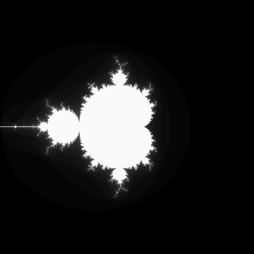 |

📁 [Code source](src/fractale/main.cpp)

### Description
Dans cet exercice, un algorithme génère une image représentant la fractale de Mandelbrot. La fractale de Mandelbrot est un ensemble de points complexes dans le plan complexe qui produit une forme fractale lorsqu'elle est visualisée.

### Spécificités
- Deux boucles imbriquées parcourent chaque pixel de l'image et effectuent des itérations selon la formule mathématique de la fractale de Mandelbrot.
- Pour chaque pixel de l'image, l'algorithme effectue un certain nombre d'itérations pour déterminer s'il appartient à l'ensemble de Mandelbrot en fonction de sa convergence ou de sa divergence.
- La couleur du pixel est définie en fonction du nombre d'itérations nécessaires avant que la séquence ne diverge.
  
```cpp
#include <complex>

int main()
{
    sil::Image image{500, 500};
    for (float x{0}; x < image.width(); x++)
    {
        for (float y{0}; y < image.height(); y++)
        {
            float newX{x / 125 - 2};
            float newY{y / 125 - 2};
            int count{0};
            std::complex<float> c{newX, newY};
            std::complex<float> z{0.f, 0.f};
            float result{0.f};
            while (count < 50)
            {
                result = static_cast<float>(count) / 50;
                z = z * z + c;

                if (std::abs(z) > 2)
                    break;

                image.pixel(x, y) = glm::vec3{result};
                count++;
            }
        }
    }

    image.save("output/pouet.png");
}
```

### Pièges potentiels à éviter
- L'utilisation d'un booléen pour la boucle while. L'algorithme ne parviendrai pas à sortir de la boucle.
  
<br>
<br>

## ⭐⭐⭐(⭐) Vortex

| Avant | Après |
| ----------- | ----------- |
|  |  |

📁 [Code source](src/vortex/main.cpp)

### Description
Dans cet exercice, un effet de vortex a été appliqué à l'image. L'algorithme effectue une transformation de chaque pixel en utilisant une rotation autour d'un centre donné.

### Spécificités
- Une fonction `rotated` est utilisée pour effectuer la rotation des pixels autour d'un centre de rotation.
- La transformation de rotation est appliqué en fonction de la distance par rapport au centre de l'image.

### Pièges potentiels à éviter
- Sortir de l'image en remplaçant les pixels.
- Attribuer les nouvelles coordonnées `newPoint.x, newPoint.y` de la nouvelle image `voidImage`. -> Notre transformation serait décalé par rapport au centre `x,y` de notre image d'origine.
```cpp
if (newPoint.x < image.width() && newPoint.x >= 0 && newPoint.y < image.height() && newPoint.y >= 0)
    voidImage.pixel(x, y) = image.pixel(newPoint.x, newPoint.y);
```

<br>
<br>

## ⭐⭐⭐(⭐) Tramage

| Avant | Après |
| ----------- | ----------- |
|  |  |

📁 [Code source](src/bayer/main.cpp)


### Description
Dans cet exercice, un effet de tramage a été appliqué à l'image. L'algorithme transforme l'image en une version trame à l'aide d'une matrice de Bayer prédéfinie pour effectuer un tramage ordonné.

### Spécificités
- Une fonction `bwImage` est utilisée pour convertir l'image en noir et blanc en remplaçant chaque composante RGB par la moyenne des valeurs R, G et B de chaque pixel pour obtenir des nuances de gris.
- Le tramage est réalisé en itérant sur chaque pixel de l'image et en ajoutant une valeur prédéfinie de la matrice de Bayer à chaque pixel en noir et blanc.
- Selon la valeur résultante après l'ajout, les pixels sont convertis soit en noir (0), soit en blanc (1).

<br>
<br>
## ⭐⭐⭐(⭐) Normalisation de l'histogramme

| Avant | Après |
| ----------- | ----------- |
|  |  |

📁 [Code source](src/normalisation/main.cpp)

### Description
Dans cet exercice, un effet de normalisation de l'histogramme a été appliqué à l'image. L'algorithme détermine le pixel le plus sombre pour le transformer en noir pur `0` et le pixel le plus clair pour le transformer en blanc pur `1`, normalisant ainsi la plage de valeurs des pixels.

### Spécificités
- En utilisant les valeurs identifiées pour le pixel le plus sombre `darkPixel` et le plus clair `whitePixel`, l'algorithme normalise les valeurs RGB de chaque pixel en calculant la moyenne des composantes RGB en fonction du pixel le plus sombre et clair.

### Pièges potentiels à éviter
- Lors du calcul de normalisation, il ne faut pas oublier de multiplie par **l'inverse** de la valeur de notre pixel le plus clair pour ne pas se retrouver avec un histogramme trop sombre.
```cpp
    image.pixel(x, y).r = (image.pixel(x, y).r - darkPixel) * 1 / whitePixel;
    image.pixel(x, y).g = (image.pixel(x, y).g - darkPixel) * 1 / whitePixel;
    image.pixel(x, y).b = (image.pixel(x, y).b - darkPixel) * 1 / whitePixel;
``` 
<br>
<br>

## ⭐⭐⭐⭐ Tri de pixels

| Avant                        | Après                                          |
| ---------------------------- | ---------------------------------------------- |
|  |  |

📁 [Code source](https://github.com/smallboyc/imac-cpp-workshop/blob/main/src/pixel_sorting/main.cpp)

### Description :

- On souhaite récupérer une portion rectangulaire de pixels. Cette portion doit être trié en fonction de l'intensité. Ainsi le pixel le plus lumineux se trouve au début de la portion et le moins lumineux à la fin. On replace ensuite la portion dans l'image au même endroit.

### Spécificités :
- On nous donne la fonction suivante, permettant de trier les éléments d'un tableau `table`.
```cpp
std::sort(table.begin(), table.end(), [](glm::vec3 &color1, glm::vec3 &color2)
{ return brightness(color1) < brightness(color2); });
```
- Voici la fonction `brightness` qui retourne la somme des composantes RGB d'un pixel.
```cpp
float brightness(glm::vec3 &color)
{
    return (color.r + color.g + color.b);
}
```

- L'idée est de s'inspirer du glitch en sélectionnant un rectangle de pixel. On trouve aléatoirement un pixel de départ sur l'image et on parcourt une taille généré aléatoirement (pas trop grande non plus) et on fixe pour ce code `y` à 1.
```cpp
  glm::vec2 inputPositionStart{random_int(0, image.width()), random_int(0, image.height())};
  glm::vec2 rectangleSize{random_int(20, 30), 1};
```
- Chaque pixel du rectangle est push dans un tableau.
```cpp
 for (int i{0}; i < rectangleSize.x; i++)
    {
        for (int j{0}; j < rectangleSize.y; j++)
        {
            if (inputPositionStart.x + i < image.width() &&
                inputPositionStart.y + j < image.height())
                table.push_back(image.pixel(inputPositionStart.x + i, inputPositionStart.y + j));
        }
    }
```
- On appelle la fonction de tri sur `table`.
- On doit alors finalement boucler de la même façon sur notre rectangle en attribuant aux positions, les nouveaux pixels triés du tableau.
- On utilise alors une variable `count` pour parcourir notre tableau.
  
```cpp
   int count{0};
    for (int i{0}; i < rectangleSize.x; i++)
    {
        for (int j{0}; j < rectangleSize.y; j++)
        {
            if (inputPositionStart.x + i < image.width() &&
                inputPositionStart.y + j < image.height())
            {

                image.pixel(inputPositionStart.x + i, inputPositionStart.y + j) = table[count];
                count++;
            }
        }
    }
```
- On obtient là un rectangle trié. Il suffit maintenant de boucler!
- Tout le code ci-dessus a été implémenté dans une fonction `getRectangle()` excepté la fonction `brightness`.
```cpp
int main()
{
    sil::Image image{"images/logo.png"};
    for (int i{0}; i < 1000; i++)
        getRectangle(image);
    image.save("output/pouet.png");
}
```
### Potentiels problèmes
- Oublier le `count`. Cette variable est essentielle pour être certain de parcourir tout notre tableau trié et ainsi de placer les pixels au bon endroit.
- Ne pas vérifier les bornes. Il faut en effet s'assurer que les pixels que l'on manipule se trouvent dans l'image.